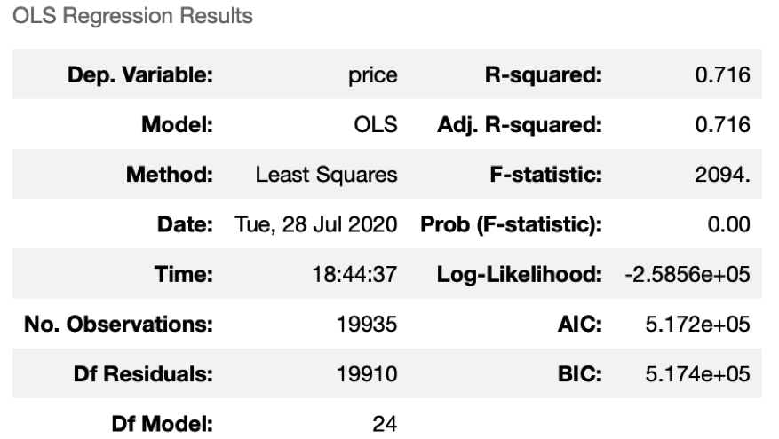
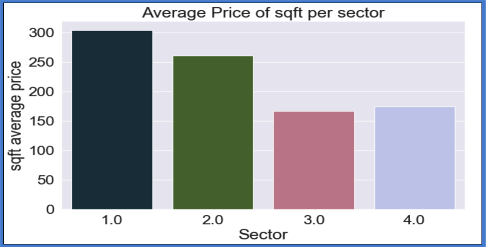

# HOUSE PRICE ANALYSIS - King County (2014-2015)

This study was done for stakeholders assumed to be investors trying to built a portfolio of real state. The price range requested by them was up to 1,000,000$ per property with no specific characteristics per unit. Their objective is to get the most value possible for their money.

## Business Problem

In order to be able to give the best advice possible it will be necessary to answer the following questions:

* Which areas are within their price range?
* What is the square foot average price by each one of the previously selected locations?
* What variables (property characteristics) should the investors be looking at  

To answer those questions the following objectives have to be covered:

## Goals/Objectives

* Find the best location within the price range 
* Average price per square foot for each of the previously defined locations 
* Find out if it is worth looking at waterfront or inland units
* Compare average price of new vs. older property
* Find out if the number of bedrooms and/or bathrooms will affect the pricing
 

# DATA

The dataset that we worked with is the King County House Sales database from 2014 - 2015. This data consists of the following information:

* id: House unique identifier number
* date: Date the house was sold
* Price: Home price (prediction target)
* Bedrooms: Number of bedrooms
* Bathrooms: number of bathrooms
* sqft_living: square footage of the home
* sqft_lot: square footage of the lot
* floors: Total floors(levels) in the house
* waterfront: House having a vies to the waterfront
* view: number of views
* condition: how good the condition is
* grade: overall grade given to the house unit
* sqft_above: square footage of house apart from basement
* sqft_basement: square footage of the basement
* yr_renovated: year when the house was renovated
* zipcode: zip
* lat: latitude coordinate
* long: longitude coordinate
sqft_living15: the square footage of interior housing living space for the nearest 15 neighbors
* sqft_lot15: the square footwage of the land lots of the nearest 15 neighbors

# DATA CLEANING

A thorough data cleaning process was done following the workflow below:

* Cast columns to their appropriate data type
* Identify and deal with missing values
* Identify and deal with misplaced characters/values/words, such as "?" (interrogation signs) in numeric columns
* Identify and deal with duplicated values
* Remove what were considered as unnecessary columns
* Perform data engineer when possible and necessary

A separate Notebook on all the Data Cleaning is available under the name: M2_Data_Cleaning. This document not only contains the Data Cleaning but also part of the Data Engineering and some of the EDA done. Furthermore a preliminary Linear Regression Base Model has been tested here.

A first past for variables/features that could produce collinearity to the model was done by looking at the correlation coefficients and using heatmaps. Also, for practicality purposes, decisions to reduce the number of categories of some variables was made. Two good examples are the zipcode and the grade. Grades for example, had values ranging from 3 to 13. As a solution 4 grade categories were created by grouping the original grades based on their mean house price (see Data Cleaning for details). 

Finally a cleaned dataframe was saved and converted to .csv file which was the input for the Data Exploration and further Engineering that will be explain later on. 

# DATA EXPLORATION

The EDA was done as an iterative process since the data cleaning started. Not only was time spent by looking at the dataframe itself and its characteristics, but also a series of plots and maps were used to better understand the information from each column and possible relationships (collinearity and multicollinearity) between them

With the first pass on the data it was noticed that the "zipcode" column was going to probably be the most important one in terms of affecting the price of the properties. However, we were dealing with 70 different categories, therefore, it was decided to group them into 4 different sectors. These sectors were defined by plotting all the houses on a map color coded by their price. It was then relatively easy to see that 4 main areas could be identified, which were named Sector 1, 2, 3 and 4 respectively (Figure 1). Nevertheless, the average price per zipcode was calculated and a bar plot was made which ratified that the prices are directly tied to the zipcodes (Figure 2)


<b>Figure 1</b>. Map displaying all properties color coded by price


<b>Figure 2</b>. Average price per zipcode

There are other variables/features that were rapidly identified as candidates to affect the price, such as condition and/or grade which seemed to be related to each other, price of the square foot of the living area, and possibly the waterfront, plus others.

Once the Data Cleaning was done, a correlation was calculated for all the remaining and newly engineered variables. This helped identified dependencies between different variables, and suggested that several of them could be dropped as they would affect the model with collinearity. Figure 3 is a heatmap with the correlation coefficients overlaid. This map will give the reader an idea of where the collinearity and possible multicollinearity would come from (For a final cleaned heatmap look in the Final_Modeling notebook).


<b>Figure 3</b>. Heatmap with correlation coefficients activated

By looking at the plots from the document Final_Modeling, we managed to start making some hypothesis:

1. Location will be directly correlated to price and will be key for the model's performance and predictions
2. Waterfront property is clearly more expensive than inland, however, there might not be enough data points to use it as a predictor. We will be able to make a recommendation based on it, but hard to see it affecting the model overall. Independent EDA will be done with further engineering (see document Questions_and_Results for details) to address this issue
3. The square foot of living will also affect the model's performance and the final house price will be dependent on it. Most probably the number of bedrooms and bathrooms will have some dependencies to it
4. Some of the engineered variables will need to be dropped as it is suspected that will have very high correlation with the source variable and might not affect the model's predictions in any way

During this process a few categoricals were identified and dummies were calculated but not for all of them because some were dealt with in a different way such as the zipcode which was replaced by 4 different sectors. Details on this are available on the Final_Modeling notebook. 

Most of the key visualizations that were used to answers the questions initially listed will be found in the Questions_and_Results Notebook. 


# MODEL

Three different Models were made and fitted, however, only two are described and discussed here. Both of these have the same input dataframe that is the result of the data cleaning process. The only difference between them is that Model_1 dealt with the collinearity and/or multicollinearity directly by putting a threshold on the correlation coefficients of 0.75 and looking a their p-values and how they affected the model during several fitting runs. Model_2 on the other hand, uses vif (variance inflation factor) to completely eliminate the collinearity and/or multicollinearity. At the end, it was decided to keep Model_1 due to better p-value(s) and R-squared, however, we do know that this means that most probably there is multicollinearity in our model and this can lead to mis-interpretation, nevertheless, the Probability Plot (Figure_4) and the "Actual vs Predicted Price plot"(Figure_5), suggest that even when not a great model, an error of +11% for our price range, is acceptable up to around 600 to 700,000 Dollars, afterwards the model under-estimates the house price. 

Furthermore, the residual's histogram (Figure_6) seemed to be pretty good with slight skewness almost undetectable at certain scales and as it can be seen on the Final_Modeling notebook, all of our variables ended with p-values way below our threshold of 0.05. 


<b>Figure 4</b>. Probability plot


<b>Figure 5</b>. Actual vs Predicted Price Plot


<b>Figure 6</b>. Residual's histogram

The results of the OLS Regression Results can be seen on Figure 7, and again, more detail can be found on the Final_Modeling Notebook. 


<b>Figure 7</b>. OLS Regresion Model Results


Model_3, which is not discussed on this project, is slightly different when it comes to the Data Cleaning. The steps are the same but with the addition of eliminating the outliers from all the categories by using the 3 standard deviation rule. That reduced the data significantly and even when it seems as it could give a more accurate model as output, we didn't get good results. It is believed that some mistakes might have been made on the way so with more refinement good results should be obtained 

# INTERPRETATION 

Three variables/features were chosen initially as part of our hypothesis, these were: the sector (location based on lat and long), square foot of living (sqft_living) and the bedrooms. The final model however, doesn't support all of these three as the most predictive ones. The bedrooms increase the price of the property up to a certain number (6 to 7) and then they start decreasing the property price. Because I created sectors, the results vary among each so it is hard to come up with a specific number, but by looking at the plots from the notebooks it becomes clear that the trend is to decrease and the coefficient is negative so it is hard to use this variable. 

The sqft of living and sqft of living 15 (related to the 15 surrounding houses) are the most predictive variable according to the model. Sector 1 is a very good predictor as well but the others don't seem to be that great. Bedrooms aren't good, whereas bathrooms are, which is strange. I'm not sure how to explain this. Grade_C is another top predictor but this is expected as it comprises very good grades: 9 to 11 out of a range from 3 to 13, so clearly expensive homes will be within this range.  

The Waterfront to my surprise is also a strong predictor. I assumed that it wouldn't be due to the small sample number but the model suggests differently. Maybe because of the creation of Sectors (?) 

Other variables were looked at in more detail and further EDA was done to better understand their prediction capability with little success. No additional analysis after this was done due to time constrain. 

I strongly believe that zipcode could have been a strong price predictor as I mentioned in the beginning. So further work could be done in the future to better understand them and see if the model is improved.  

With the previous explanation, a list of the variables that the model gave as strong predictors is listed below:
* sqft_living
* sqft_living15
* waterfront
* Grade_C
* sqft_lot
* sector_1
* renovation
* bathroom

As mentioned below, the model seems to be ok up to around 600 to 700 thousand Dollars, after than it under-estimate house prices. Still that price range gives quite a lot of option considering that the average house price is in the ball park of 450 thousand Dollars

With the OLS Regression model results, further EDA and data engineering was done for some of these categories so that the message could be easier transfered to out Stakeholders. Unfortunately, not much more could be added

One of the most interesting findings was the "Average Price per Square foot" by sector (Figure 8). Our results, as illustrated on Figure 8, suggest that sector one has a higher price per square foot than sector 2. But when we look at the map with all the houses color coded, it is clear that the most expensive ones are within Sector 2. Why is this plot suggesting this then? to answer this question we went back to the model's predictions and look at our final dataframe and realized that in average, houses in Sector 2 are 33% bigger than houses from sector 1 (Figure 9), therefore the average price of houses from sector 2 is higher than those on sector 1. This means that even when the overall price is higher, still the most expensive square footage is on Sector 1. This was not expected but made total sense once understood.  


<b>Figure 8</b>. Average Price per sqft by sector.


<b>Figure 9</b>. Additional data from Average Price vs sqft by sector


Another finding, less interesting but still important to take into account, is that the cheapest sector overall to invest in is Sector 3. However, as an investment it might not be too attractive as we cannot see this trend changing in the future as the water is further away and normally the closer you are to the water the more expensive it gets. The good thing with the model is that because the average price is so much lower (~300 thousand Dollars), it would work quite well on this sector. 

The number of bedrooms was another interesting variable. Even when it is clearly dependent on the overall size of the houses, it doesn't have a direct relationship with size, meaning that price will not always increase with the number of bedrooms in the house, and the same goes for bathrooms. This is a problem that needed the addition of the rest of the data and could not be dealt with just by looking at the filtered data and this varies depending on the sector, but in general terms, each sector has a magic number where the prices start to switch downwards/ For the bathrooms is quite clear which we still don't understand the reasoning behind it (Figure 10 and 11)


<b>Figure 10</b>. Average Price per number of bedrooms per sector


<b>Figure 11</b>. Average Price per number of bathrooms per sector

If interested, there are other variables that were explore with different results and are discussed on the Questions_and_Results notebook. 


# RECOMMENDATIONS

For our stakeholders budget the recommendations are the following:

* Following the model look at the sqft_living and sqft_living15 as the best predictors, followed by, but in no specific order: the waterfront, Grade_C which corresponds to grades between the range of 9 and 11, sector_1 and homes that have been renovated.

* Within the budget that was given to us, try not to exceed the 600 to 700 thousand Dollar mark per property, as it is after those values that the model starts to under-estimate the price by over 100 thousand Dollars. 

* An alternative it to go to sector 4 which has a lot lower prices and hence considerable lower error from the model.

Some recommendations or way forward for the modeling would be to try to add more data. The data that we have corresponds only to 2014 and 2015 and that is a small sample for investors as it is hard to predict longterm price variability and were the most profitable places to buy would be. Furthermore, looking into the zipcodes in detail will allow to give more specific and accurate recommendations, and finally some data on schools, public transportation and proximity to hospitals will also help and those are known to affect property price. 


```python

```
